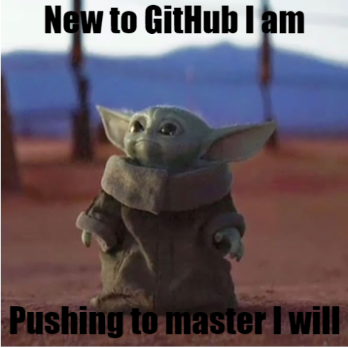
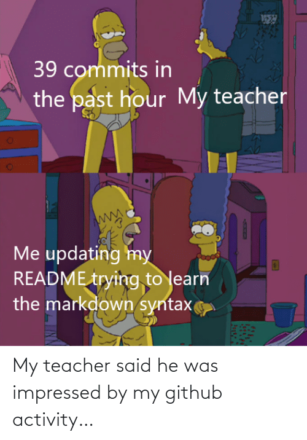
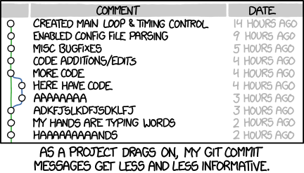
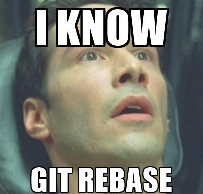
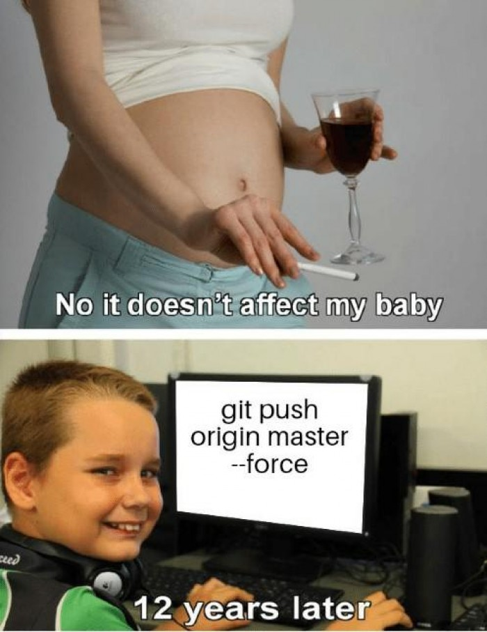

# Lesson 4: Git/Github

## Plan

- Git
 - Syntaxis
- Github
 - GitHub Limitiation
 - Git **LFS**
- Markdown

## Git/Github

What the diffrence between **Git** and **Git***Hub* ?
> The same as between **Porn** and **Porn***Hub*

### CheatSheet 

**PDF** - **P**rint **D**efinition **F**ormat 

[PDF file](Res/git-cheat-sheet.pdf) - For printing

### Git Syntaxis

- `git init` - We initilize project and `.git` folder is mader

- `git add .` - We add all untrack files *except* `.gitignore`

- `cp .gitignore` - We copy our git ignore

- `git commit -m "Init"` - we are making commits

- `git remote add origin git@github.com:BloodAndScience/C0de2Bleed.git` - add remote address

- `git push -u origin main` - set where all our changes will be pushed	

- `git push` - add changes

- `git pull` - get changes

- `git branch $YOURE_BRANCH_NAME` - create the branch

- `git checkout $YOURE_BRANCH_NAME` - switch between branches

### Git Syntaxis 2

`git rebase` - Move changes from one branch to another

`git diff` - to see what the difrence between branches

`git status` - To see unstaged and staged changes

`git branch` - give us possible list of branches

`git log -n 5` - to see last loged changes

### Git commit

### Branches 

### Git Rebase

## Git Merge

### Git Push --force

### Markdown Syntaxis
