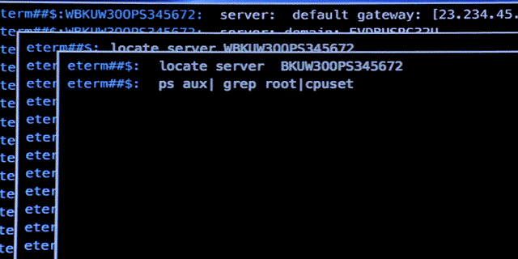

# ComanG Tech Standards

**🔥👩🏻‍💻TERMINAL IS COOL😎**

Here will be our lesson and important things to work as a team

## Lessons

- [Lesson 1](.\Lesson1.md)

## Core Tools

- [Microsoft Terminal](https://learn.microsoft.com/en-us/windows/terminal/install)
- [GH CLI](https://cli.github.com/)

## Roadmap

- CLI(Terminal)
- Git
- MarkdDown
- Vim(NeoVim)

## Goals

- [x] 🥇CreateRepo
- [ ] 📚Add CheetSheets
- [ ] 😎Make Series of learning session with Adamov
- [ ] 🐸Create Usable Knowladge Base that all company can Use

## CLI

👩🏻‍💻 Termainal is cool

### List of tools

- ffmpeg
- gh
- git
- yt-dlp
- python3
- ipython
- jupyter

